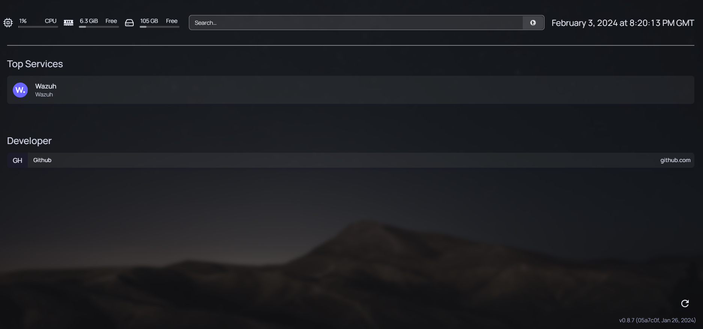

# Homepage Configurations

## settings.yml File

1. The <mark style="color:red;">`settings.yaml`</mark> file allows you to define application level options. For changes made to this file to take effect, you will need to regenerate the static HTML, this can be done by clicking the refresh icon in the bottom right of the page.

### Background Image <a href="#background-image" id="background-image"></a>

1. If you'd like to use a background image instead of the solid theme color, you may provide a full URL to an image of your choice.

```yaml
background: https://images.unsplash.com/photo-1502790671504-542ad42d5189?auto=format&fit=crop&w=2560&q=80
```

### Background Opacity & Filters <a href="#background-opacity-filters" id="background-opacity-filters"></a>

1. You can specify filters to apply over your background image for blur, saturation and brightness as well as opacity to blend with the background color. The first three filter settings use tailwind CSS classes, see notes below regarding the options for each. You do not need to specify all options.

```yaml
background:
  image: https://images.unsplash.com/photo-1502790671504-542ad42d5189?auto=format&fit=crop&w=2560&q=80
  blur: sm
  saturate: 50
  brightness: 50
  opacity: 50
```

### Theme <a href="#theme" id="theme"></a>

1. You can configure a fixed them (and disable the theme switcher) by passing the `theme` option, like so:

```yaml
theme: dark # or light
```

### Color Palette <a href="#color-palette" id="color-palette"></a>

1. You can configured a fixed color palette (and disable the palette switcher) by passing the `color` option, like so:

```yaml
color: slate
```

## services.yml

1. Services are configured inside the <mark style="color:red;">`services.yaml`</mark> file. You can have any number of groups, and any number of services per group.
2. In this example it will be configured a service group, with a <mark style="color:red;">`icon`</mark> from [https://github.com/walkxcode/dashboard-icons](https://github.com/walkxcode/dashboard-icons), a <mark style="color:red;">`href`</mark> pointing the URL of the service and a <mark style="color:red;">`description`</mark>.

```yaml
- Top Services:
    - Wazuh:
        icon: wazuh-opaque.svg
        href: https://192.168.117.128/app/login
        description: Wazuh
```

<figure><figcaption><p>Fig 1. Homepage Dashboard</p></figcaption></figure>
